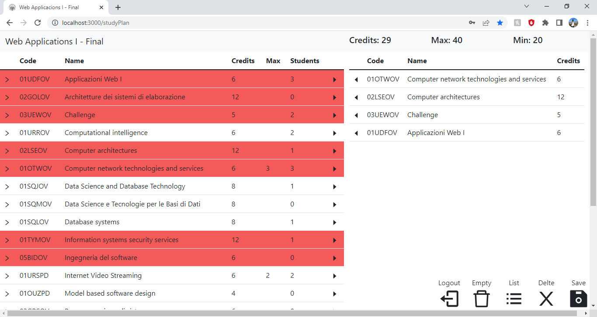

# Web applications I - Politecnico di Torino

## Table of Contents

- [About](#about)
- [Server side](#server-side)
  - [User API](#user-api)
  - [Study Plan API](#study-plan-api)
  - [Database description](#database-description)
- [Client side](#Client-side)

## About

Write about 1-2 paragraphs describing the purpose of your project.

## Server side

### User API

#### GET /api/session

- **Get the current user status**.
- **Response**: `200 OK` (success); body: object with user id, name and email.

```
{
	"id": 3,
	"name": "testuser",
	"email": "a.b@c.d"
}
```

- **Error responses**: `401 Unauthorized` (not logged in or wrong permissions), `500 Internal Server Error` (generic error).

#### POST /api/login

- **Start the current user session**.
- **Request body**: email (called 'username') and 'password'.
- **Response**: `200 OK` (success); body: object with user id, name and email.

```
{
	"id": 3,
	"name": "testuser",
	"email": "a.b@c.d"
}
```

- **Error responses**: `401 Unauthorized` (not logged in or wrong permissions), `500 Internal Server Error` (generic error). `404` (No object found).

#### POST /api/logout

- **End the current **.
- **Response**: `200 OK` (success); body: none

#### PUT /api/type

- **Start the current user session**.
- **Request body**: new type for a student.
- **Response**: `200 OK` (success); body: object with the new type.

```
{
	'newType':'FULL_TIME'
}
```

- **Error responses**: `401 Unauthorized` (not logged in or wrong permissions), `500 Internal Server Error` (generic error). `404` (No object found).

### Study Plan API

#### GET /api/courses

- **Get all the courses with their students, dependant courses and incompatible courses**.
- **Response**: `200 OK` (success); body: object with the list of courses and the count of students.

```
[
	{
		"code": "01OTWOV",
		"name": "Computer network technologies and services",
		"credits": 6,
		"maxstudents": 3,
		"students": 2,
		"incompatibles": [
			"02KPNOV"
		],
		"dependants": []
	},
	{
		"code": "01SQJOV",
		"name": "Data Science and Database Technology \n\n",
		"credits": 8,
		"maxstudents": null,
		"students": 1,
		"incompatibles": [
			"01SQMOV",
			"01SQLOV"
		],
		"dependants": []
	},...
]
```

- **Error responses**:`500 Internal Server Error` (generic error).

#### GET /api/studyPlan

- **Get all the courses of a study plan related to the user and they incompatible and dependant**.
- **Response**: `200 OK` (success); body: object with the list of courses.

```
[
[
	{
		"code": "01OTWOV",
		"name": "Computer network technologies and services",
		"credits": 6,
		"incompatibles": [
			"02KPNOV"
		],
		"dependants": []
	},
	{
		"code": "01TYMOV",
		"name": "Information systems security services ",
		"credits": 12,
		"incompatibles": [
			"01UDUOV"
		],
		"dependants": []
	},...
]
```

- **Error responses**:`401 Unauthorized` (not logged in or wrong permissions) `500 Internal Server Error` (generic error).

#### POST /api/newStudyPlan

- **Create a new study plan**.
- **Response**: `200 OK` (success); body: empty.
- **Error responses**: `401 Unauthorized` (not logged in or wrong permissions), `500 Internal Server Error` (generic error). `400 bad request` (A plar alrready exists)

#### DELETE /api/deleteStudyPlan

- **Delete a study plan**.
- **Response**: `200 OK` (success); body: empty.
- **Error responses**: `401 Unauthorized` (not logged in or wrong permissions), `500 Internal Server Error` (generic error). `400 bad request` (A plar alrready exists)

#### PUT /api/editStudyPlan

- **Change the courses of a study plan**.
- **Request body**: A ready list of items to add the a plan.
- **Response**: `200 OK` (success).

```
{
	"courseList":
	[
		{"code":"01OTWOV",
		"name":"Computer network technologies and services",
		"credits":"6",
		"maxstudents":"3"},
		{"code":"01TYMOV",
		"name":"Information systems security services",
		"credits":"12"}
	]
}
```

- **Error responses**: `401 Unauthorized` (not logged in or wrong permissions), `500 Internal Server Error` (generic error). `404` (No object found), `422` (Content error).

### Database description

| Database     | Purpose                                                                  |
| ------------ | ------------------------------------------------------------------------ |
| Users        | Keeps the users: Name, Email, Password hash, Salt and Type               |
| STUDY_PLAN   | Stores the study plan relationship with the user and its current credits |
| COURSE_PLAN  | Is the middle table between study plans and courses                      |
| COURSE       | Table of the courses with code, name, credits and max students           |
| INCOMPATIBLE | Has the relationship of incompatibility among courses                    |
| DEPENDANT    | Has the relationship of dependency among courses                         |

## Server side

### Routes

| Route        | Description                                                                                  |
| ------------ | -------------------------------------------------------------------------------------------- |
| '/'          | The base route. Will get you to the log-in page and also contains the navigation buttons.    |
| '/start'     | Route for the initial form to create the study plan. Contains the selection of student type. |
| '/studyPlan' | Contains the study plan which can be edited from there.                                      |

### Main Components

- MainLayout
  -- ButtonSet
- CoursesTable
- StudyPlanTable
- InitialForm

## Overall

### Screenshot



### Usernames and Passwords

| Email           | Password |
| --------------- | -------- |
| a.b@c.d         | password |
| real@email.com  | password |
| other@email.com | password |
| correo@real.co  | password |
| last@email.com  | password |
